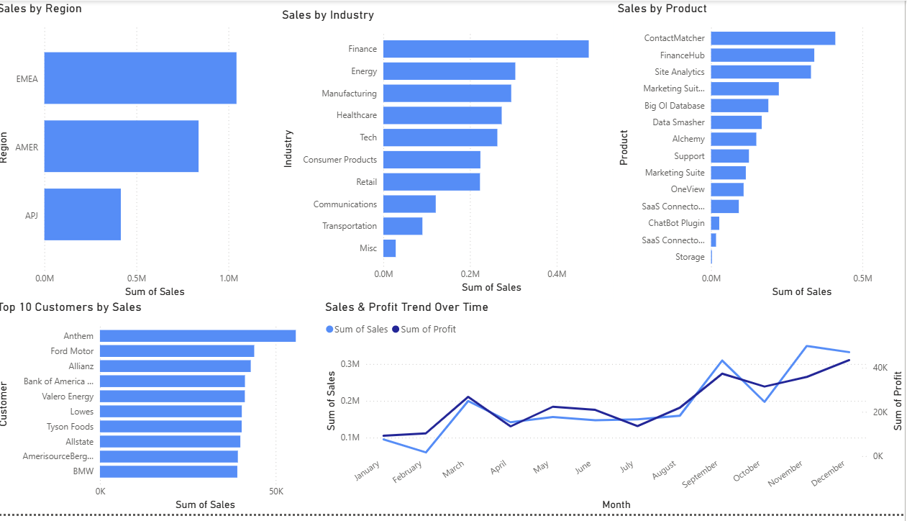

 SaaS Market Research Dashboard — Power BI

## Overview
This project presents an interactive Power BI dashboard analyzing Amazon AWS SaaS sales data across regions, industries, customers, and products. Built from a market research perspective, the dashboard answers the core questions a Market Researcher or Business Analyst at a tech company would bring to a strategy meeting — where is revenue concentrated, which customer segments drive growth, and how does performance trend over time.

## Live Dashboard Preview

## Dataset
- **Source:** [Amazon AWS SaaS Sales Dataset — Kaggle](https://www.kaggle.com/datasets/nnthanh101/aws-saas-sales)
- **Coverage:** Multi-year SaaS transaction data across regions, industries, and products
- **Tool:** Microsoft Power BI Desktop

## Skills Demonstrated
- Data loading and modeling in Power BI
- DAX measures for aggregated sales and profit calculations
- Multi-visual dashboard design and layout
- Cross-filtering and interactive slicers
- Dual-axis line chart for sales and profit trend analysis
- Top N filtering for customer segmentation

## Dashboard Components

### Visual 1 — Sales by Region
EMEA leads all regions with over $1M in total sales, followed by AMER and APJ. This geographic concentration suggests the business should prioritize EMEA customer retention while investing in AMER growth initiatives to reduce regional dependency.

### Visual 2 — Sales by Industry
Finance dominates industry sales, followed by Energy and Manufacturing. Tech and Healthcare trail significantly despite being natural SaaS buyer segments — representing clear market expansion opportunities for a dedicated sales push.

### Visual 3 — Top 10 Customers by Sales
Anthem leads all customers, followed by Ford Motor and Allianz. The top 10 spans Finance, Automotive, Healthcare, and Energy — confirming strong cross-industry enterprise penetration. Heavy revenue concentration in a small number of accounts signals churn risk if any top customer leaves.

### Visual 4 — Sales & Profit Trend Over Time
Sales show a clear upward trend from January through December with a significant spike in November and December. A mid-year dip from April through August reflects typical B2B SaaS seasonality. Profit tracks closely with sales, indicating consistent margins throughout the year.

### Visual 5 — Sales by Product
ContactMatcher leads all products by a wide margin, followed by FinanceHub and Site Analytics. The long tail of lower-performing products suggests a portfolio rationalization opportunity — focusing marketing resources on the top 3-5 products could significantly improve revenue efficiency.

## Key Market Research Insights
- EMEA is the dominant market — retention and upsell strategies should prioritize this region
- Finance sector represents the highest revenue concentration — a dedicated vertical strategy would strengthen this position
- November/December spike indicates strong Q4 budget cycle buying behavior — marketing campaigns should front-load Q3 to capture pipeline before year-end
- ContactMatcher's dominance signals strong product-market fit — investment in its development and promotion should be prioritized
- Top 10 customers span multiple industries, confirming the product is horizontally applicable across enterprise verticals

## Files
- `SaaS_Market_Analysis.pbix` — Full Power BI report file
- `dashboard_preview.png` — Dashboard screenshot
